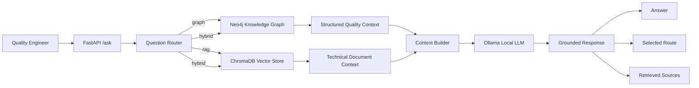
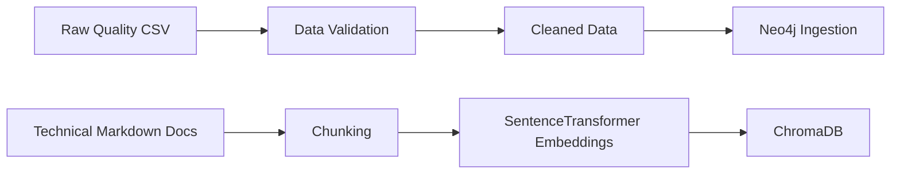

# Automotive Quality Intelligence Assistant

An AI-powered automotive quality investigation system that combines a **Knowledge Graph, Retrieval-Augmented Generation (RAG), and a local LLM** to analyze structured quality data and technical documentation.

The system helps a quality engineer investigate questions such as:

> "Is Supplier_B showing a battery overheating problem, and what should engineers inspect?"

Instead of relying only on an LLM, the assistant retrieves quantitative evidence from automotive quality data and relevant engineering guidance from technical documents before generating a grounded response.

---

## Key Features

- Automated validation and cleaning of automotive quality data
- Neo4j knowledge graph for structured quality investigations
- Cypher-based supplier and fault analysis
- RAG pipeline over technical maintenance and quality documentation
- Semantic search using SentenceTransformers and ChromaDB
- Deterministic agentic routing between structured and unstructured data
- Hybrid investigation combining both evidence sources
- Local answer generation using Ollama
- FastAPI REST API with interactive Swagger documentation
- Automated tests for routing logic

---

## System Architecture

The assistant classifies each question into one of three investigation routes:

- **Graph** — structured quality statistics from Neo4j
- **RAG** — engineering guidance from technical documentation
- **Hybrid** — combines both sources



### Data Pipeline

Structured automotive quality data and technical documents are processed separately before being used by the assistant.


---

## Knowledge Graph

The Neo4j knowledge graph models individual inspection events instead of storing only aggregated fault relationships.

Main entities include:

- Vehicle
- Inspection
- Component
- Supplier
- Fault
- RepairAction

Example relationships:

```text
Vehicle -[:HAS_INSPECTION]-> Inspection
Inspection -[:INSPECTED_COMPONENT]-> Component
Inspection -[:SUPPLIER]-> Supplier
Inspection -[:DETECTED_FAULT]-> Fault
Inspection -[:RECOMMENDS_ACTION]-> RepairAction
```

Representing each CSV record as an **Inspection node** preserves individual fault occurrences and allows supplier-level rates and recurring quality patterns to be calculated accurately.

---

## Retrieval-Augmented Generation

Technical documentation is divided into overlapping chunks and converted into embeddings using:

```text
sentence-transformers/all-MiniLM-L6-v2
```

The embeddings are stored in **ChromaDB**.

For documentation-related questions, the user's question is embedded and compared with stored document chunks. The most relevant chunks are retrieved and supplied to the local LLM as context.

Example documents include:

- Battery maintenance guidance
- Brake sensor troubleshooting
- Temperature sensor troubleshooting
- Quality investigation procedures

This allows engineering recommendations to be grounded in retrieved documentation instead of relying solely on the LLM's internal knowledge.

---

## Agentic Routing

A deterministic question router selects the appropriate investigation path.

```text
Question
   |
   v
Router
   |
   +---- graph  ---> Neo4j
   |
   +---- rag    ---> ChromaDB
   |
   +---- hybrid ---> Neo4j + ChromaDB
```

Deterministic routing was chosen for the initial implementation because it is transparent, predictable, and straightforward to test.

---

## Example Investigation

### Question

```text
Is Supplier_B showing a battery overheating problem and what should engineers inspect?
```

### Route

```text
hybrid
```

The assistant combines:

1. supplier overheating statistics retrieved from Neo4j
2. investigation recommendations retrieved from technical documentation

The local LLM then generates two grounded sections:

```text
Quality data findings
Recommended investigation
```

The API also returns the selected route and retrieved document sources.

---

## API

Start the application:

```bash
uvicorn src.api.main:app --reload
```

Open the interactive API documentation:

```text
http://127.0.0.1:8000/docs
```

### POST `/ask`

Request:

```json
{
  "question": "Is Supplier_B showing a battery overheating problem and what should engineers inspect?"
}
```

Example response structure:

```json
{
  "question": "...",
  "route": "hybrid",
  "answer": "...",
  "sources": [
    "battery_maintenance.md",
    "quality_procedures.md"
  ]
}
```

---

## Technology Stack

| Technology | Purpose |
|---|---|
| Python | Core application and data processing |
| pandas / NumPy | Data validation and quality analysis |
| Neo4j | Automotive quality knowledge graph |
| Cypher | Structured graph investigation |
| ChromaDB | Vector database for technical documentation |
| SentenceTransformers | Document and query embeddings |
| Ollama | Local LLM inference |
| Llama 3.2 3B | Local answer generation |
| FastAPI | REST API |
| Pytest | Automated testing |

---

## Project Structure

```text
intelligent-automotive-quality/
├── data/
│   ├── raw/
│   └── processed/
├── docs/
│   ├── battery_maintenance.md
│   ├── brake_sensor_guide.md
│   ├── temperature_sensor_guide.md
│   └── quality_procedures.md
├── src/
│   ├── data_quality/
│   ├── knowledge_graph/
│   ├── rag/
│   ├── agent/
│   └── api/
├── tests/
├── screenshots/
├── requirements.txt
├── pytest.ini
└── README.md
```

---

## Setup

### 1. Clone the repository

```bash
git clone https://github.com/sayanroy11/intelligent-automotive-quality.git
cd intelligent-automotive-quality
```

### 2. Create a virtual environment

```bash
python -m venv .venv
```

Activate it on Windows Git Bash:

```bash
source .venv/Scripts/activate
```

### 3. Install dependencies

```bash
pip install -r requirements.txt
```

### 4. Configure Neo4j

Create a `.env` file in the project root:

```text
NEO4J_URI=bolt://localhost:7687
NEO4J_USERNAME=neo4j
NEO4J_PASSWORD=your_password
```

The `.env` file is excluded from Git.

### 5. Prepare the vector database

Ensure the technical Markdown documents are available under `docs/`, then run:

```bash
python src/rag/build_vector_store.py
```

### 6. Start the local LLM

Install Ollama and ensure the required model is available:

```bash
ollama pull llama3.2:3b
```

### 7. Start the API

```bash
uvicorn src.api.main:app --reload
```

Then visit:

```text
http://127.0.0.1:8000/docs
```

---

## Testing

Run the automated tests from the project root:

```bash
pytest
```

The current test suite verifies that questions are correctly classified into:

```text
graph
rag
hybrid
```

---

## Design Decisions

**Inspection-event knowledge graph:** Each quality record is represented as an inspection event so repeated faults are preserved rather than collapsed into a single graph relationship.

**Rate-based supplier analysis:** Supplier quality is compared using fault rates rather than only raw fault counts, reducing misleading conclusions when suppliers have different inspection volumes.

**Local LLM:** Ollama keeps inference local and avoids requiring a paid external LLM API.

**Deterministic routing:** The initial router uses explicit rules, making its behavior easy to understand, test, and debug.

**Grounded generation:** The LLM receives retrieved evidence and is instructed to answer using the provided structured data and technical documentation.

---

## Limitations and Future Improvements

This project is a portfolio prototype built using synthetic automotive quality data.

The current knowledge-graph retrieval is optimized for the demonstrated battery-overheating investigation rather than arbitrary automotive graph queries.

Future improvements could include dynamic Cypher generation, additional graph investigation tools, more advanced agent orchestration, Docker deployment, a dedicated frontend, and evaluation of RAG retrieval and answer quality.

---

## Project Motivation

Modern automotive quality investigations often require engineers to combine structured production data with technical documentation.

This project explores how **knowledge graphs, semantic retrieval, and local language models** can work together to provide evidence-based investigation support while keeping the underlying data sources transparent.

---

## Author

**Sayan Roy**  
M.Sc. Information Technology — University of Stuttgart

GitHub: `sayanroy11`
